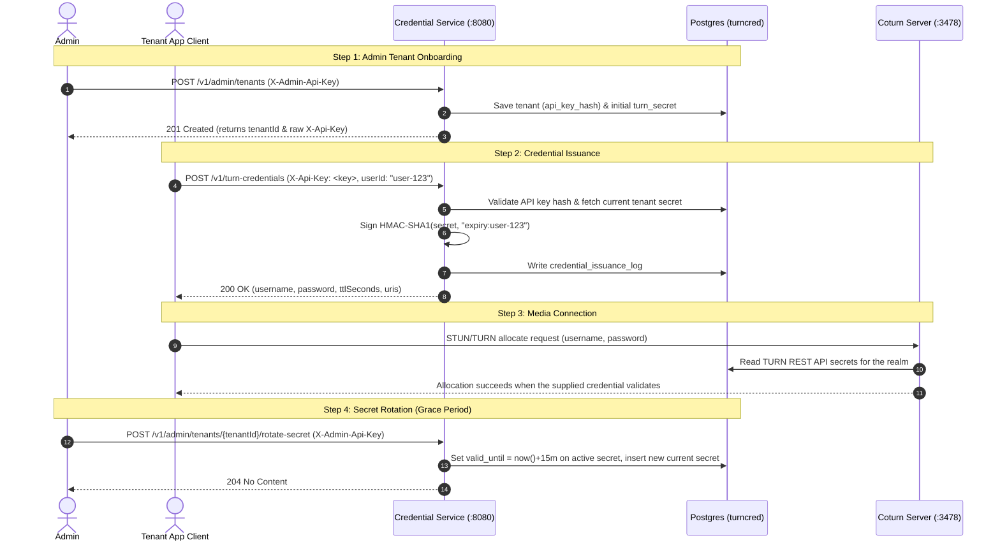

# TURN Credential Platform

Multi-tenant TURN REST API credential issuance service.

> The production Compose reference in this repository provides process/container-level HA on a **single Docker host**. It is not host-level or datacenter-level HA.

---

## API Usage Flow

Below is the complete end-to-end API workflow for onboarding tenants, issuing TURN credentials, rotating secrets with grace periods, and connecting WebRTC clients or Coturn servers.



---

## API Endpoints Reference

### 1. Provision a Tenant (Admin Endpoint)

Provision a new customer ("tenant"). The raw API key is returned **only once** upon creation.

**Request:**
```bash
curl -i -X POST http://localhost:8080/v1/admin/tenants \
  -H "X-Admin-Api-Key: dev-admin-key" \
  -H "Content-Type: application/json" \
  -d '{
        "name": "Acme Corp",
        "realm": "acme.turn.yourplatform.com"
      }'
```

**Response (`201 Created`):**
```json
{
  "tenantId": "c4a3b2a1-1234-4567-89ab-cdef01234567",
  "realm": "acme.turn.yourplatform.com",
  "apiKey": "tcp_A1b2C3d4E5f6G7h8I9j0K1l2M3n4O5p6"
}
```

> **Note:** Save the `apiKey` (`tcp_...`). The platform only stores the SHA-256 hash of this key.

---

### 2. Issue TURN Credentials (Tenant Endpoint)

Tenant applications use their API key to request ephemeral TURN REST API credentials for end users.

**Request:**
```bash
curl -i -X POST http://localhost:8080/v1/turn-credentials \
  -H "X-Api-Key: tcp_A1b2C3d4E5f6G7h8I9j0K1l2M3n4O5p6" \
  -H "Content-Type: application/json" \
  -d '{
        "userId": "user-42"
      }'
```

`userId` is optional. If omitted, the application may assign one according to the API implementation.

**Response (`200 OK`):**
```json
{
  "username": "1755700000:user-42",
  "password": "dGhpcyBpcyBhIHZhbGlkIGhtYWMgc2lnbmF0dXJl=",
  "ttlSeconds": 3600,
  "uris": [
    "turn:acme.turn.yourplatform.com:3478?transport=udp",
    "turns:acme.turn.yourplatform.com:5349?transport=tcp"
  ]
}
```

**HTTP Status Codes:**
- `200 OK`: Credential successfully generated and logged.
- `401 Unauthorized`: Missing or invalid `X-Api-Key`, or tenant status is `SUSPENDED`.
- `429 Too Many Requests`: Tenant exceeded its configured per-minute rate limit.

> **TURNS note:** the application currently advertises a `turns:...:5349` URI, but the production Compose reference does not mount a certificate/private key for Coturn. Configure `cert`/`pkey` before relying on TURNS in a real deployment.

---

### 3. Register & Manage Per-UserId Secrets (Admin Endpoints)

Pre-register specific `userId`s for a tenant and manage their dedicated TURN HMAC secrets.

#### Register a User

```bash
curl -i -X POST http://localhost:8080/v1/admin/tenants/c4a3b2a1-1234-4567-89ab-cdef01234567/users \
  -H "X-Admin-Api-Key: dev-admin-key" \
  -H "Content-Type: application/json" \
  -d '{ "userId": "user-42" }'
```

Expected response: `201 Created`.

#### Rotate a User's Secret

```bash
curl -i -X POST http://localhost:8080/v1/admin/tenants/c4a3b2a1-1234-4567-89ab-cdef01234567/users/user-42/rotate-secret \
  -H "X-Admin-Api-Key: dev-admin-key"
```

Expected response: `204 No Content` (`404 Not Found` for an unknown user).

#### Deregister / Suspend a User

```bash
curl -i -X DELETE http://localhost:8080/v1/admin/tenants/c4a3b2a1-1234-4567-89ab-cdef01234567/users/user-42 \
  -H "X-Admin-Api-Key: dev-admin-key"
```

Expected response: `204 No Content`; subsequent issuance for that user is rejected.

---

### 4. Health & Metrics Endpoints

- **Health Check**: `GET http://localhost:8080/actuator/health`
- **Prometheus Metrics**: `GET http://localhost:8080/actuator/prometheus`

---

## Automated End-to-End Testing Script

`scripts/verify-e2e.sh` builds/starts the selected Compose stack by default, waits for the API health endpoint, and executes the complete 9-step E2E API verification scenario.

### Running Default Local Compose Stack

```bash
./scripts/verify-e2e.sh
```

### Reusing an Already-Running Stack

The HA verifier calls the E2E suite with `SKIP_BUILD=1` and `SKIP_COMPOSE_UP=1` so the same production stack is tested before failover.

### Automated Verifications Executed

1. **Admin Tenant Onboarding** (`POST /v1/admin/tenants`) → `201 Created`
2. **Unregistered User Enforcement** (`POST /v1/turn-credentials`) → `403 Forbidden`
3. **Admin User Pre-Registration** (`POST /v1/admin/tenants/{tenantId}/users`) → `201 Created`
4. **Registered User Credential Issuance** (`POST /v1/turn-credentials`) → `200 OK`
5. **Admin User Secret Rotation** (`POST .../users/{userId}/rotate-secret`) → `204 No Content`
6. **Post-Rotation Credential Issuance** → `200 OK`
7. **Admin User Deregistration / Suspension** (`DELETE .../users/{userId}`) → `204 No Content`
8. **Post-Deregistration Issuance Enforcement** → `403 Forbidden`
9. **Unknown User Secret Rotation Error Handling** → `404 Not Found`

---

## Detailed Explanation: Tenant TURN Secret Rotation

### Overview & Multi-Row Schema Design

The application stores multiple `turn_secret` rows so secret rotation can preserve a grace period rather than immediately deleting the prior secret.

### Data Model Structure (`turn_secret` table)

| Column | Type | Description |
|---|---|---|
| `realm` | `VARCHAR(255)` | Tenant domain / realm; part of the composite primary key. |
| `value` | `VARCHAR(255)` | Shared secret string; part of the composite primary key. |
| `user_id` | `VARCHAR(255)` | Nullable application-level user binding. |
| `valid_until` | `TIMESTAMPTZ` | Nullable application-level expiry/grace metadata. |
| `created_at` | `TIMESTAMPTZ` | Creation timestamp. |

**Primary Key:** `(realm, value)`

The application selects the current secret (`valid_until IS NULL`) for new credential issuance and rotates older rows into a grace window.

### Important Coturn Compatibility Boundary

Upstream Coturn's PostgreSQL driver retrieves TURN REST API shared secrets using a realm-only query equivalent to:

```sql
SELECT value FROM turn_secret WHERE realm = $1;
```

Coturn does **not** support a `userdb-user-secret-query` configuration directive. Consequently, this repository must not claim that upstream Coturn itself enforces the application's `user_id` or `valid_until` columns. That per-user/expiry compatibility gap is a separate correctness/hardening workstream and is **not solved by the HA PR**.

Credential usernames still carry their TURN REST API expiration timestamp, which is a separate protocol-level expiry mechanism.

---

## Client Integration Example

```javascript
const turnResponse = await fetch('https://api.yourplatform.com/v1/turn-credentials', {
  method: 'POST',
  headers: {
    'X-Api-Key': 'tcp_A1b2C3d4E5f6G7h8I9j0K1l2M3n4O5p6',
    'Content-Type': 'application/json'
  },
  body: JSON.stringify({ userId: 'user-42' })
}).then(res => res.json());

const pc = new RTCPeerConnection({
  iceServers: [{
    urls: turnResponse.uris,
    username: turnResponse.username,
    credential: turnResponse.password
  }]
});
```

---

## Local Development

```bash
./mvnw clean package -DskipTests
docker compose up -d --build
```

Run unit tests with:

```bash
./mvnw test
```

---

## Production HA Topology

`docker-compose.prod.yml` contains the CI reference deployment:

- 3-node etcd 3.5.x quorum used as the Patroni DCS.
- 3 PostgreSQL 16 nodes managed by Patroni.
- Synchronous replication with one synchronous standby plus a third replica.
- DB HAProxy on internal port `5000`, routing only to the Patroni node whose `GET /primary` endpoint returns HTTP 200.
- 3 explicit Spring Boot services: `app1`, `app2`, `app3`.
- API HAProxy as the sole host publisher of `8080:8080`, with `/actuator/health` checks and retry redispatch on backend connection failure.
- Redis 7 with AOF persistence, but still a standalone process/SPOF.
- One Coturn instance using PostgreSQL through `db-haproxy:5000`.

```text
                         :8080
Client/API ───────► api-haproxy
                    /    |    \
                  app1  app2  app3
                    \    |    /
                     db-haproxy:5000
                       /    |    \
                     pg1   pg2   pg3
                      |     |     |
                   Patroni Patroni Patroni
                      \     |     /
                      etcd1 etcd2 etcd3

Coturn ─────────────► db-haproxy:5000
```

### HA Boundary

This is **single-host process/container HA**. Losing the Docker host still loses the complete topology. Production host/node HA requires spreading the same roles across independent hosts with Kubernetes or another orchestrator.

The following are not redundant in this Compose reference:

- Redis is standalone.
- Coturn is a single instance.
- API HAProxy and DB HAProxy are each single instances on the same Docker host.

Internal TLS/mTLS, Redis Sentinel/Cluster, multiple Coturn instances, cross-host scheduling, and PostgreSQL backup/PITR are separate hardening workstreams.

### Required Production Overrides

CI intentionally uses deterministic fallback values so pull requests can bootstrap. Real deployments must override at least:

```text
POSTGRES_SUPERUSER_PASSWORD
REPLICATOR_PASSWORD
POSTGRES_APP_DB
POSTGRES_APP_USER
POSTGRES_APP_PASSWORD
TURN_ADMIN_API_KEY
TURN_EXTERNAL_IP
TURN_PLATFORM_DOMAIN
```

### Start the Reference Stack

```bash
docker compose -f docker-compose.prod.yml up -d --build
```

### Verify the Complete HA Contract

Run the same acceptance command used in CI:

```bash
./scripts/verify-ha.sh
```

It verifies:

1. Three healthy etcd members.
2. One Patroni primary and two replicas.
3. PostgreSQL access through DB HAProxy.
4. A replication marker reaches both replicas.
5. Three healthy Spring Boot instances and API HAProxy.
6. All 9 API E2E cases through API HAProxy.
7. Stopping the current PostgreSQL primary promotes a different node.
8. Committed data survives and the Spring application can write after failover.
9. The former primary rejoins and catches up as a replica.
10. Stopping `app1` does not make the API unavailable.
11. Restarting `app1` restores three healthy application instances.

Static-only checks:

```bash
./scripts/verify-ha.sh --static-only
docker compose -f docker-compose.prod.yml config -q
```

---

## Coturn Production Notes

The production Compose file pins Coturn instead of using `latest` and routes its PostgreSQL connection through `db-haproxy:5000`.

`turnserver.prod.conf` deliberately does not contain the unsupported `userdb-user-secret-query`, `no-tlsv1`, or `no-tlsv1_1` directives.

### TURNS / 5349

The reference config declares port 5349 but does not provision `cert`/`pkey` files. Production TURNS requires certificate/private-key mounts and corresponding Coturn configuration before clients should rely on the `turns:` URI.

---

## CI

`.github/workflows/ci.yml` runs:

- `test` — Maven unit tests plus a package build.
- `ha-static-contract` — static topology/config/documentation contracts and rendered Compose validation.
- `ha-integration` — clean production topology, E2E, PostgreSQL failover/data survival/rejoin, and application redundancy.

The 9-case E2E suite currently runs inside `ha-integration`; it is not a separate GitHub Actions job.
