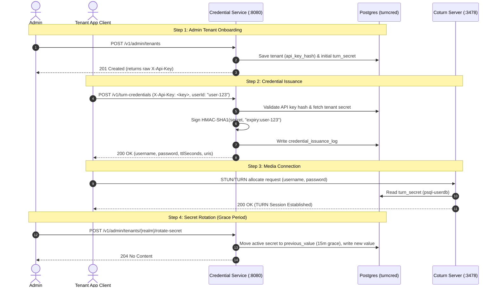
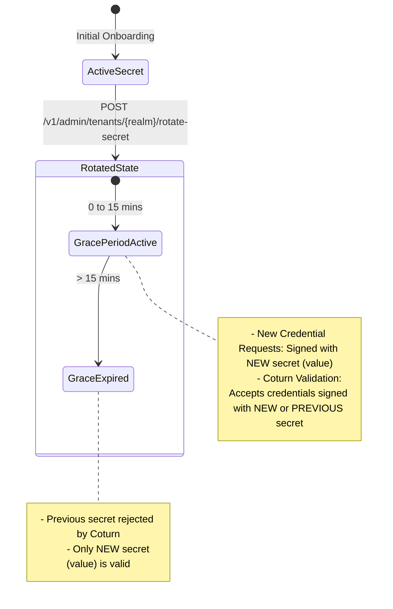

# TURN Credential Platform

Multi-tenant TURN REST API credential issuance service. Single data
center, highly available within that DC (no multi-region/multi-DC).

---

## API Usage Flow

Below is the complete end-to-end API workflow for onboarding tenants, issuing TURN credentials, rotating secrets, and connecting to coturn.



### 1. Provision a Tenant (Admin Endpoint)

Provision a new customer ("tenant"). The raw API key is returned **only once** upon creation.

**Request:**
```bash
curl -i -X POST http://localhost:8080/v1/admin/tenants \
  -H "Content-Type: application/json" \
  -d '{
        "name": "Acme Corp",
        "realm": "acme.turn.yourplatform.com"
      }'
```

**Response (`201 Created`):**
```json
{
  "tenantId": "c4a3b2a1-1234-4567-89ab-cdef01234567",
  "realm": "acme.turn.yourplatform.com",
  "apiKey": "tcp_A1b2C3d4E5f6G7h8I9j0K1l2M3n4O5p6"
}
```

> **Note:** Save the `apiKey` (`tcp_...`). The platform only stores the SHA-256 hash of this key.

---

### 2. Issue TURN Credentials (Tenant Endpoint)

Tenant applications use their API key to request ephemeral TURN REST API credentials for end users.

**Request:**
```bash
curl -i -X POST http://localhost:8080/v1/turn-credentials \
  -H "X-Api-Key: tcp_A1b2C3d4E5f6G7h8I9j0K1l2M3n4O5p6" \
  -H "Content-Type: application/json" \
  -d '{
        "userId": "user-42"
      }'
```
*(Note: `userId` is optional. If omitted, a random UUID will be assigned automatically.)*

**Response (`200 OK`):**
```json
{
  "username": "1755700000:user-42",
  "password": "dGhpcyBpcyBhIHZhbGlkIGhtYWMgc2lnbmF0dXJl=",
  "ttlSeconds": 3600,
  "uris": [
    "turn:acme.turn.yourplatform.com:3478?transport=udp",
    "turns:acme.turn.yourplatform.com:5349?transport=tcp"
  ]
}
```

**HTTP Status Codes:**
- `200 OK`: Credential successfully generated and logged.
- `401 Unauthorized`: Missing or invalid `X-Api-Key`, or tenant status is `SUSPENDED`.
- `429 Too Many Requests`: Tenant exceeded its configured per-minute rate limit.

---

### 3. Rotate Tenant TURN Secret (Admin Endpoint)

Rotate a tenant's HMAC secret with a zero-downtime grace period.

**Request:**
```bash
curl -i -X POST http://localhost:8080/v1/admin/tenants/acme.turn.yourplatform.com/rotate-secret
```

**Response (`204 No Content`)**

---

## Detailed Explanation: Tenant TURN Secret Rotation

### Overview & Problem Statement
In the TURN REST API standard (`use-auth-secret`), credentials (`username` + `password`) are signed statelessly using a shared per-tenant HMAC-SHA1 secret (`value`).

When a tenant secret needs to be rotated (e.g. routine security compliance or security incident response):
1. **Without a grace period:** Wiping the old secret immediately breaks all WebRTC clients whose credentials were issued seconds before rotation but haven't finished ICE candidate allocation yet.
2. **With a grace period:** The system retains the previous secret for a configurable window (default **15 minutes**), allowing existing credentials to validate seamlessly while forcing all new issuance requests to use the new secret.

---

### Data Model Structure (`turn_secret` table)

| Column | Type | Description |
|---|---|---|
| `realm` | `VARCHAR(255)` | Tenant domain / realm (Primary Key, FK to `tenants(realm)`). |
| `value` | `VARCHAR(255)` | Current active secret used for signing new credential requests. |
| `previous_value` | `VARCHAR(255)` | Former secret preserved for in-flight sessions during grace period. |
| `previous_valid_until` | `TIMESTAMPTZ` | Expiry timestamp (`now() + 15 minutes`) after which `previous_value` is ignored. |
| `rotated_at` | `TIMESTAMPTZ` | Timestamp when rotation was executed. |

---

### How Secret Rotation Works (Step-by-Step)



1. **Rotation Trigger (`SecretRotationService.rotate`):**
   When `POST /v1/admin/tenants/{realm}/rotate-secret` is invoked:
   - The current active secret (`value`) is copied to `previous_value`.
   - `previous_valid_until` is populated with `Instant.now().plus(Duration.ofMinutes(15))`.
   - A fresh 32-byte cryptographically secure random key (Base64 URL-safe) is generated and stored into `value`.
   - `rotated_at` is set to `Instant.now()`.

2. **Immediate Cutover for New Issuances:**
   - Calls to `POST /v1/turn-credentials` immediately fetch `secret.getValue()` and sign new credentials with the **new secret**.

3. **Dual-Secret Validation in Coturn (`psql-userdb`):**
   - Coturn reads the `turn_secret` table directly from PostgreSQL (`psql-userdb`).
   - During STUN/TURN allocation attempts, Coturn verifies incoming HMAC-SHA1 signatures against `value`. If signature validation fails and `previous_valid_until > now()`, Coturn falls back to validating against `previous_value`.

4. **Grace Window Expiry:**
   - Once 15 minutes elapse (`now() > previous_valid_until`), Coturn rejects any remaining credentials signed with `previous_value`.

---

### 4. Connect to Coturn or WebRTC Client

#### A. WebRTC Client (`RTCPeerConnection` configuration)
```javascript
const turnResponse = await fetch('https://api.yourplatform.com/v1/turn-credentials', {
  method: 'POST',
  headers: {
    'X-Api-Key': 'tcp_A1b2C3d4E5f6G7h8I9j0K1l2M3n4O5p6',
    'Content-Type': 'application/json'
  },
  body: JSON.stringify({ userId: 'user-42' })
}).then(res => res.json());

const pc = new RTCPeerConnection({
  iceServers: [
    {
      urls: turnResponse.uris,
      username: turnResponse.username,
      credential: turnResponse.password
    }
  ]
});
```

#### B. Manual Verification via `turnutils_uclient`
```bash
turnutils_uclient -u "1755700000:user-42" -w "dGhpcyBpcyBhIHZhbGlk..." -p 3478 localhost
```

---

## Local Development

Start Postgres, Redis, Coturn, and the Spring Boot application locally via Docker Compose:

```bash
mvn clean package -DskipTests
docker compose up -d --build
```

---

## Production Topology

See `docker-compose.prod.yml`:
- 3-node etcd cluster (Patroni DCS)
- 3-node Patroni-managed Postgres cluster (1 leader, 1 sync replica, 1 async replica)
- HAProxy fronting Postgres (routes writes & reads to current Patroni leader via `/leader` healthcheck on port 8008)
- Redis 7 (rate limiting)
- Coturn cluster (`psql-userdb` reading Postgres through HAProxy)
- N Credential Service Spring Boot instances (Java 21 virtual threads)

**Manual Failover Test:**
```bash
docker compose -f docker-compose.prod.yml stop pg1
# Confirm another node is promoted to leader within ~10-30s
# and credential issuance continues through haproxy:5000
```
