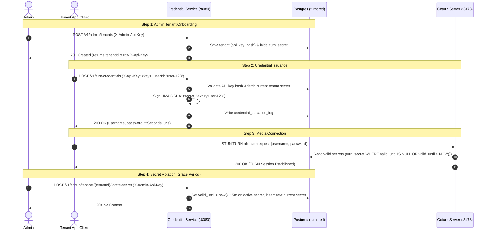
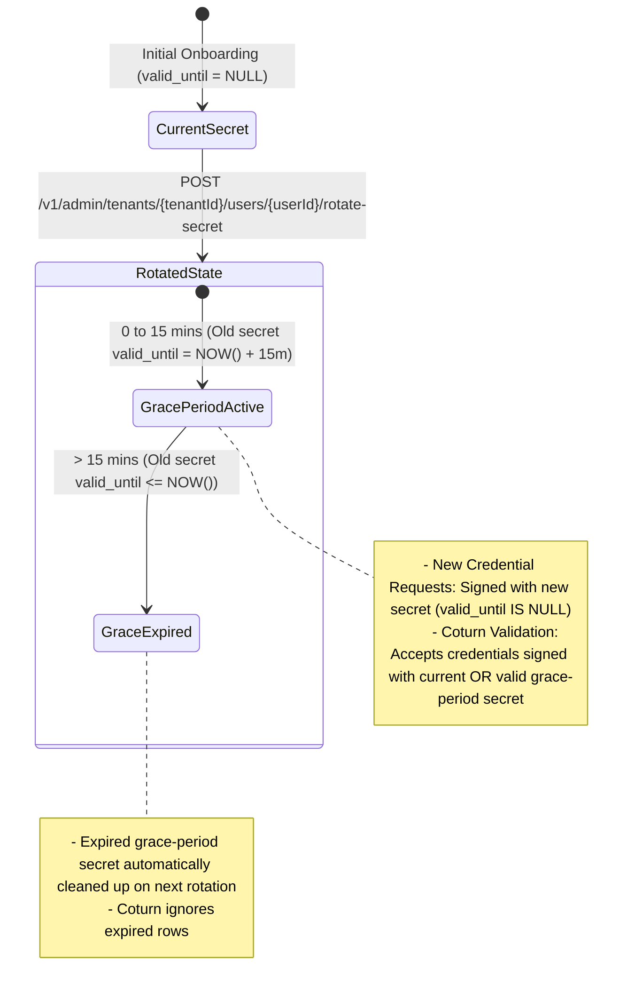

# TURN Credential Platform

Multi-tenant TURN REST API credential issuance service. Single data center, highly available within that DC.

---

## API Usage Flow

Below is the complete end-to-end API workflow for onboarding tenants, issuing TURN credentials, rotating secrets with grace periods, and connecting WebRTC clients or Coturn servers.



---

## API Endpoints Reference

### 1. Provision a Tenant (Admin Endpoint)

Provision a new customer ("tenant"). The raw API key is returned **only once** upon creation.

**Request:**
```bash
curl -i -X POST http://localhost:8080/v1/admin/tenants \
  -H "X-Admin-Api-Key: dev-admin-key" \
  -H "Content-Type: application/json" \
  -d '{
        "name": "Acme Corp",
        "realm": "acme.turn.yourplatform.com"
      }'
```

**Response (`201 Created`):**
```json
{
  "tenantId": "c4a3b2a1-1234-4567-89ab-cdef01234567",
  "realm": "acme.turn.yourplatform.com",
  "apiKey": "tcp_A1b2C3d4E5f6G7h8I9j0K1l2M3n4O5p6"
}
```

> **Note:** Save the `apiKey` (`tcp_...`). The platform only stores the SHA-256 hash of this key.

---

### 2. Issue TURN Credentials (Tenant Endpoint)

Tenant applications use their API key to request ephemeral TURN REST API credentials for end users.

**Request:**
```bash
curl -i -X POST http://localhost:8080/v1/turn-credentials \
  -H "X-Api-Key: tcp_A1b2C3d4E5f6G7h8I9j0K1l2M3n4O5p6" \
  -H "Content-Type: application/json" \
  -d '{
        "userId": "user-42"
      }'
```
*(Note: `userId` is optional. If omitted, a random UUID will be assigned automatically.)*

**Response (`200 OK`):**
```json
{
  "username": "1755700000:user-42",
  "password": "dGhpcyBpcyBhIHZhbGlkIGhtYWMgc2lnbmF0dXJl=",
  "ttlSeconds": 3600,
  "uris": [
    "turn:acme.turn.yourplatform.com:3478?transport=udp",
    "turns:acme.turn.yourplatform.com:5349?transport=tcp"
  ]
}
```

**HTTP Status Codes:**
- `200 OK`: Credential successfully generated and logged.
- `401 Unauthorized`: Missing or invalid `X-Api-Key`, or tenant status is `SUSPENDED`.
- `429 Too Many Requests`: Tenant exceeded its configured per-minute rate limit.

---

### 3. Register & Manage Per-UserId Secrets (Admin Endpoints)

Pre-register specific `userId`s for a tenant and manage their dedicated TURN HMAC secrets.

#### Register a User
**Request:**
```bash
curl -i -X POST http://localhost:8080/v1/admin/tenants/c4a3b2a1-1234-4567-89ab-cdef01234567/users \
  -H "X-Admin-Api-Key: dev-admin-key" \
  -H "Content-Type: application/json" \
  -d '{ "userId": "user-42" }'
```
**Response (`201 Created`):**
```json
{
  "userId": "user-42",
  "tenantId": "c4a3b2a1-1234-4567-89ab-cdef01234567"
}
```

#### Rotate a User's Secret (15-Minute Zero-Downtime Grace Period)
**Request:**
```bash
curl -i -X POST http://localhost:8080/v1/admin/tenants/c4a3b2a1-1234-4567-89ab-cdef01234567/users/user-42/rotate-secret \
  -H "X-Admin-Api-Key: dev-admin-key"
```
**Response (`204 No Content`)** *(Returns `404 Not Found` if user is unregistered)*

#### Deregister / Suspend a User
**Request:**
```bash
curl -i -X DELETE http://localhost:8080/v1/admin/tenants/c4a3b2a1-1234-4567-89ab-cdef01234567/users/user-42 \
  -H "X-Admin-Api-Key: dev-admin-key"
```
**Response (`204 No Content`)** *(Subsequent credential requests for `user-42` will return `403 Forbidden`)*

---

### 4. Health & Metrics Endpoints

- **Health Check**: `GET http://localhost:8080/actuator/health`
- **Prometheus Metrics**: `GET http://localhost:8080/actuator/prometheus`

---

## Automated End-to-End Testing Script

An automated bash script is provided in [`scripts/verify-e2e.sh`](file:///home/vht/project/turn-credential-platform/scripts/verify-e2e.sh) to build the application, spin up the Docker stack, wait for healthiness, and execute the complete 9-step E2E API verification scenario.

### Running Default Local Compose Stack

```bash
./scripts/verify-e2e.sh
```

### Running Production Multi-Node HA Topology Stack

```bash
COMPOSE_FILE=docker-compose.prod.yml ./scripts/verify-e2e.sh
```

### Automated Verifications Executed:
1. **Admin Tenant Onboarding** (`POST /v1/admin/tenants`) → `201 Created`
2. **Unregistered User Enforcement** (`POST /v1/turn-credentials`) → `403 Forbidden`
3. **Admin User Pre-Registration** (`POST /v1/admin/tenants/{tenantId}/users`) → `201 Created`
4. **Registered User Credential Issuance** (`POST /v1/turn-credentials`) → `200 OK`
5. **Admin User Secret Rotation** (`POST .../users/{userId}/rotate-secret`) → `204 No Content`
6. **Post-Rotation Credential Issuance** → `200 OK` (verifies new HMAC password signature)
7. **Admin User Deregistration / Suspension** (`DELETE .../users/{userId}`) → `204 No Content`
8. **Post-Deregistration Issuance Enforcement** → `403 Forbidden`
9. **Unknown User Secret Rotation Error Handling** → `404 Not Found`

---

## Detailed Explanation: Tenant TURN Secret Rotation

### Overview & Multi-Row Schema Design
In the TURN REST API standard (`use-auth-secret`), credentials (`username` + `password`) are signed statelessly using a shared per-tenant HMAC-SHA1 secret (`value`).

When a tenant secret is rotated:
1. **Without a grace period:** Wiping the old secret immediately breaks WebRTC clients whose credentials were issued right before rotation but haven't completed ICE candidate allocation yet.
2. **With a multi-row grace period:** The application marks the previous secret to expire after a 15-minute window (`valid_until = NOW() + 15m`), and creates a new current secret (`valid_until IS NULL`). Coturn and the API read all valid secrets for the realm.

---

### Data Model Structure (`turn_secret` table)

| Column | Type | Description |
|---|---|---|
| `realm` | `VARCHAR(255)` | Tenant domain / realm (Part of Composite PK, FK to `tenants(realm)`). |
| `value` | `VARCHAR(255)` | Shared secret string (Part of Composite PK). |
| `user_id` | `VARCHAR(255)` | Nullable user ID (`NULL` = legacy realm secret; non-`NULL` = per-userId secret). |
| `valid_until` | `TIMESTAMPTZ` | Nullable expiry timestamp. `NULL` = current active secret for new issuances. Non-`NULL` timestamp in future = grace-period secret. |
| `created_at` | `TIMESTAMPTZ` | Creation timestamp (`now()`). |

**Primary Key:** `(realm, value)`  
**Partial Unique Index:** `uq_turn_secret_current_realm` on `turn_secret(realm) WHERE user_id IS NULL AND valid_until IS NULL`  
**Partial Unique Index:** `uq_turn_secret_current_user` on `turn_secret(realm, user_id) WHERE user_id IS NOT NULL AND valid_until IS NULL`  

---

### How Secret Rotation Works (Step-by-Step)



1. **Rotation Trigger (`UserSecretRotationService.rotateUserSecret`):**
   When `POST /v1/admin/tenants/{tenantId}/users/{userId}/rotate-secret` is called:
   - Expired grace-period rows (`valid_until <= NOW()`) are deleted.
   - The current active secret (`valid_until IS NULL`) is updated to `valid_until = Instant.now().plus(Duration.ofMinutes(15))`.
   - A fresh cryptographically secure 32-byte secret (Base64 URL-safe) is inserted with `valid_until = NULL`.

2. **Immediate Cutover for New Issuances:**
   - `POST /v1/turn-credentials` calls `findCurrentByRealmAndUserId()` (`valid_until IS NULL`) and signs new credentials with the **new secret**.

3. **Dual-Secret Validation in Coturn (`psql-userdb`):**
   - Coturn queries Postgres for valid secrets (`valid_until IS NULL OR valid_until > NOW()`).
   - During STUN/TURN allocation attempts, Coturn validates signatures against any active secret for the tenant realm or specific `userId`.

---

## Client Integration Examples

### WebRTC Client (`RTCPeerConnection`)
```javascript
const turnResponse = await fetch('https://api.yourplatform.com/v1/turn-credentials', {
  method: 'POST',
  headers: {
    'X-Api-Key': 'tcp_A1b2C3d4E5f6G7h8I9j0K1l2M3n4O5p6',
    'Content-Type': 'application/json'
  },
  body: JSON.stringify({ userId: 'user-42' })
}).then(res => res.json());

const pc = new RTCPeerConnection({
  iceServers: [
    {
      urls: turnResponse.uris,
      username: turnResponse.username,
      credential: turnResponse.password
    }
  ]
});
```

### Manual Verification via `turnutils_uclient`
```bash
turnutils_uclient -u "1755700000:user-42" -w "dGhpcyBpcyBhIHZhbGlk..." -p 3478 localhost
```

---

## Local Development

Start Postgres, Redis, Coturn, and the Spring Boot application locally via Docker Compose:

```bash
mvn clean package -DskipTests
docker compose up -d --build
```

---

## Production Topology

See `docker-compose.prod.yml`:
- 3-node etcd cluster (Patroni DCS)
- 3-node Patroni-managed Postgres cluster (1 leader, 1 sync replica, 1 async replica)
- HAProxy fronting Postgres (routes writes & reads to current Patroni leader via `/leader` healthcheck on port 8008)
- Redis 7 (rate limiting)
- Coturn cluster (`psql-userdb` reading Postgres through HAProxy)
- N Credential Service Spring Boot instances (Java 21 virtual threads)

